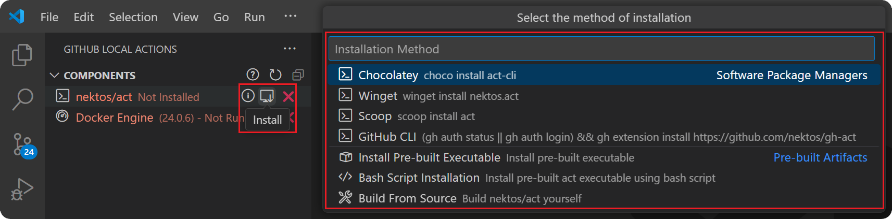
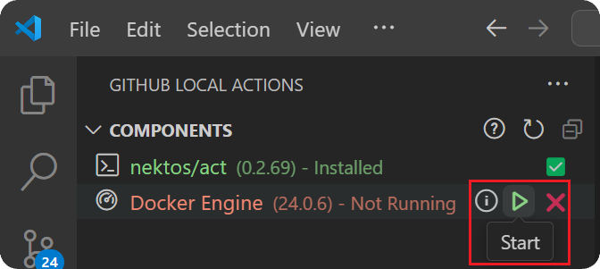
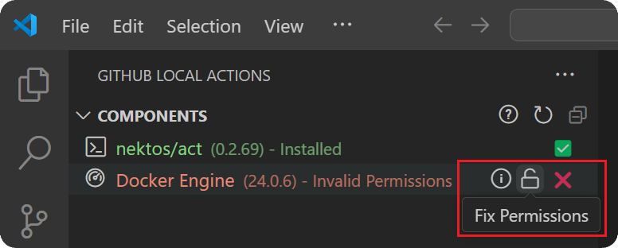

import { CardGrid, LinkCard } from '@astrojs/starlight/components';

The `Components` view is where you can manage the components for using the extension.

<CardGrid>
   <LinkCard title="🛠️ nektos/act" href="#nektosact" description="Act the is the CLI tool which will be used for actually running your workflows locally."/>
   <LinkCard title="🐋 Docker Engine" href="#docker-engine" description="Docker Engine is required for act to function as it uses Docker to handle workflow execution."/>
</CardGrid>

---

## nektos/act

[nektos/act](https://github.com/nektos/act) provides the core functionality for running GitHub Actions locally. Whenever a workflow, job, or event is triggered, the extension is essentially building up an act command and executing it as a [VS Code task](https://code.visualstudio.com/docs/editor/tasks). 

:::tip
If you notice an issue with running a particular command using the extension, try manually running the command in the terminal. This can be done by copying and pasting the command which is printed at the top of the task. If there is a discrepancy in output, please [open an issue](https://github.com/SanjulaGanepola/github-local-actions/issues).
:::

### Installing nektos/act

If you do not have act installed, it can be installed using several software package managers or using a pre-built artifact using the `Install` action in the `Components` view. 



### Act Command Configuration

The `Act Command` configuration defined in the [VS Code Settings](https://code.visualstudio.com/docs/getstarted/settings) is the base nektos/act command to be called when running a GitHub Action locally. By default, this will be `act` (requires the binary to be on your `PATH`). If the binary is not on your `PATH`, the command should be fully qualified. If act is installed as a GitHub CLI extension, this command should be set to `gh act`.

If act continues to remain as `Not Installed` in the `Components` view, try configuring the `Act Command` in the VS Code Settings by searching for the following configuration:

```log
@ext:sanjulaganepola.github-local-actions githubLocalActions.actCommand
```

## Docker Engine

Docker (or more specifically Docker Engine API) is required for nektos/act if you plan to run workflows in containers. The containers are configured to mirror GitHub's environment, including matching [environment variables](https://docs.github.com/en/actions/writing-workflows/choosing-what-your-workflow-does/store-information-in-variables#default-environment-variables) and [filesystems](https://docs.github.com/en/actions/using-github-hosted-runners/using-github-hosted-runners#file-systems), ensuring a consistent and reliable local execution. As part of `act`, Docker Engine API will be used for the following:
    
* Pulling or building the images specified in your workflow files
* Determining the execution path based on your workflow's dependencies
* Running containers for each action using the prepared images

:::caution
If you do not require container isolation, you can run selected (e.g. Windows or MacOS) workflow jobs directly on your system. In this case, you do not need to have docker installed or running. Click <a href="/github-local-actions/usage/settings#runners">here</a> to learn how to use your host system as your runner.
:::

### Installing Docker Engine

Installation will have to be done manually outside the extension using the links below.

<CardGrid>
   <LinkCard title="Docker Desktop on Windows" href="https://docs.docker.com/desktop/setup/install/mac-install/"/>
   <LinkCard title="Docker Desktop on MacOS" href="https://docs.docker.com/desktop/setup/install/windows-install/"/>
   <LinkCard title="Docker Engine on Linux" href="https://docs.docker.com/engine/install/"/>
</CardGrid>

### Starting Docker Engine

Before running any workflows, you should ensure the `Docker Engine` appears as `Running` in the `Components` view. If it is `Not Running`, you can use the `Start` action to launch Docker Desktop for Windows and MacOS. For Linux, a VS Code task will be launched to start the docker daemon using the command:

```sh
systemctl start docker
```



### Configuring Docker Desktop Path (Windows and MacOS)

The `Docker Desktop Path` configuration defined in the [VS Code Settings](https://code.visualstudio.com/docs/getstarted/settings) is used to set the path to your Docker Desktop executable (used for Windows and MacOS). This executable is what will be launched when using the `Start` action from the `Components` view. The default paths based on OS are as follows:

* **Windows**: `C:/Program Files/Docker/Docker/Docker Desktop.exe`
* **MacOS**: `/Applications/Docker.app`

If this path needs to be updated, search for the following configuration in the VS Code Settings:

```log
@ext:sanjulaganepola.github-local-actions githubLocalActions.dockerDesktopPath
```

### Fixing Permission Issues (Linux)

By default, the Docker daemon binds to a Unix socket owned by the root user. To manage Docker as a non-root user, a Unix group called `docker` should be created with your user added to it.

If the extension detects that you are running in a Linux environment and encounter a permission issue with starting the docker daemon, the Docker Engine status will appear as `Invalid Permissions` in the `Components` view. In this case, you can use the `Fix Permissions` action which will attempt to resolve the issue by creating the Unix group and adding your user to it using the command:

```sh
sudo groupadd docker; sudo usermod -aG docker $USER
```



## Components To be Integrated

The components below can be used in the extension, but are not currently manageable via the `Components` view. These will however be integrated in the near future! For any questions on how to use these components with the extension, please post on the [discussion board](https://github.com/SanjulaGanepola/github-local-actions/discussions).

<LinkCard title="🗄️ Runner.Client" href="https://github.com/christopherhx/runner.server" description="Runner.Client is an alternative CLI tool to nektos/act for also running GitHub Actions locally."/>