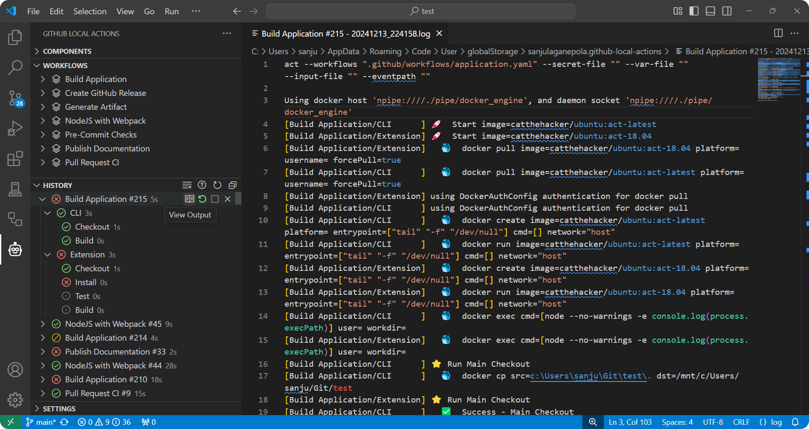

The `History` view is where you can manage workflows currently being executed as well as review logs from previous workflow runs.

The history entry name will be `<workflow_name> #<count>` or `<workflow_name>/<job_name> #<count>`.

