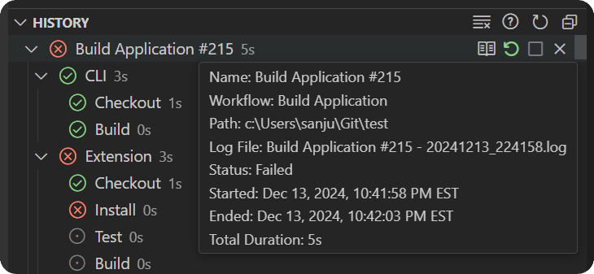

import { CardGrid, Card, LinkCard } from '@astrojs/starlight/components';

The `History` view is where you can browse and manage workflows currently being executed as well as review logs from previous workflow runs.

<CardGrid>
   <LinkCard title="🔎 Browse History Entries" href="#browse-history-entries"/>
   <LinkCard title="✏️ Manage History Entries" href="#manage-history-entries"/>
</CardGrid>

---

## Browse History Entries

History entries are created every time a workflow or job is executed. Each of these entries use the following naming convention:

* **Workflow History**: `<workflow_name> #<id>`
* **Job History** `<workflow_name>/<job_name> #<id>`

:::danger
All history is stored in VS Code storage in such a way that it uses the path of the workspace folder to locate all relevant history entries. This means that changing the path of your project can result in history entries not being found.

💡 This is currently a limitation, but could potentially be addressed. If users find this to be a major issue, please [open an issue](https://github.com/SanjulaGanepola/github-local-actions/issues).
:::

History entries can be expanded to view the specific jobs and steps that were executed. At the workflow, job, and step level, you can check the associated status and hover to view more details. In addition, you can access the execution output of all history entries.

<Card title="History Status" icon="star">
The history status of a workflow, job, and step can be used to understand whether a workflow passed or where it went wrong.

| Success                                                   | Failure                                                   | Cancelled                                                   | Skipped                                                   | Unknown                                                   |
|-----------------------------------------------------------|-----------------------------------------------------------|-------------------------------------------------------------|-----------------------------------------------------------|-----------------------------------------------------------|
| 

   | 

   | 

 | 

   | 

 |
</Card>
<Card title="History Details" icon="document">
The history details provide useful information. In particular the starting and ending timestamp as well as the total duration can be used to diagnose workflow issues.

</Card>
<Card title="History Output" icon="open-book">
The history output for all entries are stored in log files on disk. These files are located in a folder allocated for the extension in VS Code's global storage directory. Use the `View Output` action on any history entry to easily access any of these logs.

:::caution
Removing an entry for the `History` view will also delete the associated log file from disk.
:::
</Card>

## Manage History Entries

To manage running and completed history entries, the following actions can be used:

* `Restart`: Re-run the associated workflow or job using the <a href="/github-local-actions/usage/settings">settings</a> currently set.
* `Stop`: Stop a workflow or job by interrupting the act command in execution. `Ctrl+c` or `Cmd+c` can also be used on a VS Code task to have the same effect.
* `Remove`: Remove a history entry from the list and delete the associated log file from disk.
* `Focus Task` (*right-click action*): Focus on the VS Code task associated with the history entry if it is still open.