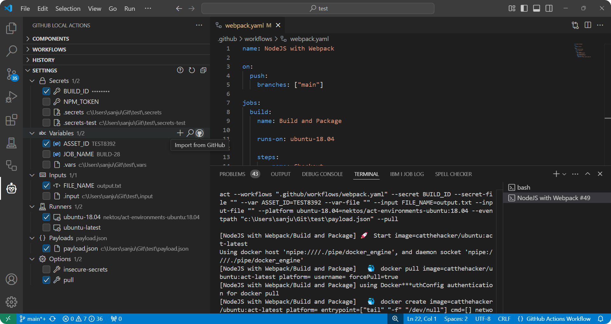

The `Settings` view is where you can set [secrets](https://nektosact.com/usage/index.html#secrets), [variables](https://nektosact.com/usage/index.html#vars), [inputs](https://nektosact.com/usage/index.html#pass-inputs-to-manually-triggered-workflows), and [runners](https://nektosact.com/usage/runners.html) to be used when executing workflows.

> 🚨 Checkout the [nektos/act](https://nektosact.com) documentation for more details on how these various settings are handled. In particular, refer to how secrets can be provided to workflows interactively, as environment variables, or from a file.

