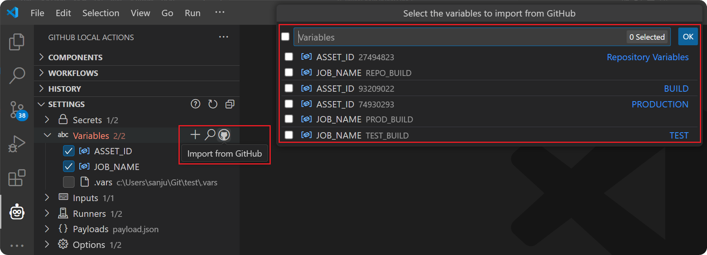
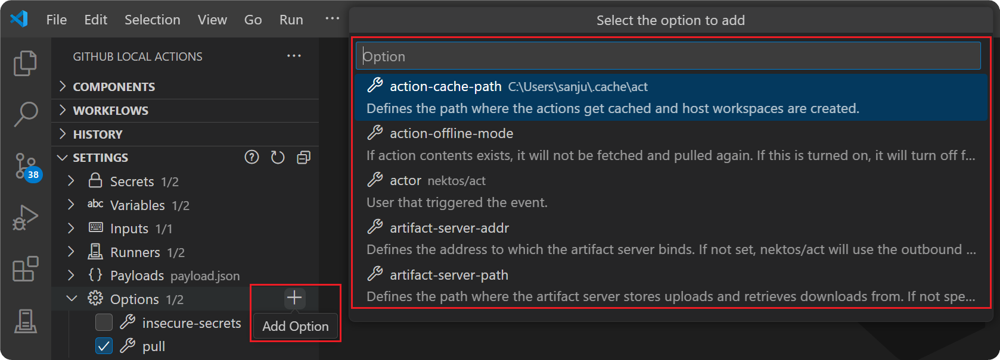

import { CardGrid, LinkCard } from '@astrojs/starlight/components';

The `Settings` view is where you can configure various settings to be used when executing workflows.

<CardGrid>
   <LinkCard title="🔒 Secrets" href="#secrets" description="Configure sensitive information used in workflows."/>
   <LinkCard title="🔤 Variables" href="#variables" description="Define workflow variables and import from GitHub."/>
   <LinkCard title="⌨️ Inputs" href="#inputs" description="Assign input values for workflow runs."/>
   <LinkCard title="🗄️ Runners" href="#runners" description="Customize runners for executing workflows."/>
   <LinkCard title="📦 Payloads" href="#payloads" description="Configure payloads that define event properties."/>
   <LinkCard title="⚙️ Options" href="#options" description="Define additional act options related to cache, artifacts, containers, etc."/>
</CardGrid>

---


## Secrets

Secrets of the format `${{ secrets.mySecret }}` are extracted from all workflow files and shown in the `Settings` view. These secrets can be assigned a value using the *Edit* action and the values visibility can be toggled using the `Show`/`Hide` action. After assigning a value, it must also be checked so that it can be used during execution. During the execution, act will include all checked secrets that have a value assigned using the `--secret` option which specifies just the key of the secret (ie. `--secret mySecret`). The value for all secrets will be included as an environment variables in the process tied to the VS Code task.

:::note
All secrets are stored safely in VS Code's [SecretStorage](https://code.visualstudio.com/api/references/vscode-api#SecretStorage) so they can be persisted after closing your workspace.
:::

An alternative to assigning values to these secrets in the `Settings` view is to use the `Create Secret File` action to create a file for storing these secrets (default file name is `.secrets`). This file should use the Ruby's gem [dotenv](https://github.com/bkeepers/dotenv) format as act uses the [godotenv](https://github.com/joho/godotenv) library to parse these types of files.

Example `.secrets` file:

```ini
export mySecret='my-secret-value'
PRIVATE_KEY="---...\nrandom text\n...---"
JSON="{\n\"name\": \"value\"\n}"
SOME_SECRET=SOME_SECRET_VALUE
```

In the case, you already have a file containing these secrets, you can use the `Locate Secret Files` action to load them into the `Settings` view. Although you can have multiple secret files added to the `Settings` view, you can only select one to be used for execution. Upon selecting one and running a GitHub Action, act will include it using the `--secret-file` option which specifies the path to the secret file.

Click [here](https://nektosact.com/usage/index.html#secrets) to learn more about how secrets can be passed to act.

## Variables

Variables of the format `${{ secrets.myVariable }}` are extracted from all workflow files and shown in the `Settings` view. These variables can be assigned a value using the *Edit* action just like secrets and must be checked for it to be used during execution. During execution, act will include them using the `--var` option which specifies the value for a variable (ie. `--var myVariable=myValue`).


If you have matching repository or environment variables defined in GitHub and would like to use the same values locally, you can use the `Import from GitHub` action to authenticate and load these values into the `Settings` view. You must ensure your GitHub account has the adequate authority to access these variables to use this action.



Similar to the secrets file, an alternative is to use the `Create Variable File` action to create a file for storing variable values (default file name is `.vars`). This file should also use the Ruby's gem [dotenv](https://github.com/bkeepers/dotenv) format as act uses the [godotenv](https://github.com/joho/godotenv) library to parse these types of files too.

Example `.vars` file:

```ini
export myVariable='my-variable-value'
JSON="{\n\"name\": \"value\"\n}"
SOME_VARIABLE=SOME_VARIABLE_VALUE
```

Although you can also use the `Locate Variable Files` to load in multiple existing files just like you can with secrets, you can only select one to be used for execution. Upon selecting one and running a GitHub Action, act will include it using the `--var-file` option which specifies the path to the variable file.

Click [here](https://nektosact.com/usage/index.html#vars) to learn more about how variables can be passed to act.

## Inputs

Inputs of the format `{{ inputs.myInput }}` and `{{ github.event.inputs.myInput }}` are extracted from all workflow files and shown in the `Settings` view. The features for managing these inputs are very similar to the features for managing [variables](#variables) described above. Refer to that section for more details and note the following differences:

* Act will use the `--input` option which specifies the value for an input (ie. `--input myInput=myValue`).
* Act will use the `--input-file` option which specifies the path to an input file (default file name is `.input`). Example `.input` file:
  ```ini
  export myInput='my-input-value'
  JSON="{\n\"name\": \"value\"\n}"
  SOME_INPUT=SOME_INPUT_VALUE
  ```
* Instead of using an input file, inputs can also be specified in a [payload](#payloads) file as well. Refer to this example JSON payload file named `payload.json`:
  ```json
  {
    "inputs": {
      "NAME": "Manual Workflow",
      "SOME_VALUE": "ABC"
    }
  }
  ```

Click [here](https://nektosact.com/usage/index.html#pass-inputs-to-manually-triggered-workflows) to learn more about how inputs can be passed to act.

## Runners

When running workflows in GitHub, [virtual environments](https://docs.github.com/en/actions/using-github-hosted-runners/using-github-hosted-runners/about-github-hosted-runners) are used. For `act` to run workflows locally, it must run a container for the runner defined in your workflow file. There are several [default images](https://nektosact.com/usage/runners.html#runners) which act uses for this based on runner type and size.

The `Edit` action can be used in the `Settings` view to specify a different image for a runner. This will use the `--platform` option which specifies a custom image to use per platform (ie. `--platform <platform>=<docker-image>`). For example, if your workflow uses `ubuntu-18.04`, consider the below example which changes the Docker image used to run the workflow:

```sh
act --platform ubuntu-18.04=nektos/act-environments-ubuntu:18.04
```

:::note
In the case you are running act in an environment that matches the platform for your workflow, you can opt out of using docker and run the workflow on your host system. Refer to the examples below:

```sh
act -P ubuntu-latest=-self-hosted
act -P windows-latest=-self-hosted
act -P macos-latest=-self-hosted
```
:::

Click [here](https://nektosact.com/usage/runners.html#runners) to learn more about how runners can be passed to act.

## Payloads

When running GitHub Actions, in some cases your workflows may rely on event properties. In this case, you will have to provide these properties as an event payload.

For example, to partially simulate a `pull_request` event, you should provide at least the `head_ref` and `base_ref`. These values can then be accessed in your workflow file using `${{ github.event.pull_request.<...> }}`. These properties can be set using an event payload file (`payload.json`) with content such as the following:

```json
{
  "pull_request": {
    "head": {
      "ref": "sample-head-ref"
    },
    "base": {
      "ref": "sample-base-ref"
    }
  }
}
```

This file can be created using the `Create Payload File` action in the `Settings` view and must be checked for it to be included during execution. Checking it will cause the `act` command to use the `--eventpath` option which specifies the path to the event payload file.

:::tip
For a full description of all GitHub events and the associated payload properties, refer to the official [GitHub documentation](https://docs.github.com/en/actions/writing-workflows/choosing-when-your-workflow-runs/events-that-trigger-workflows).
:::

Click [here](https://nektosact.com/usage/index.html#using-event-file-to-provide-complete-event-payload) to learn more about how payloads can be passed to act.

## Options

Act provides several other options which can be used to configure how workflows are run. This includes configuring how cache is handled, where artifacts are stored, what container options to use, and much more. To include any of these options during execution, use the `Add Option` action and select the desired options. For certain options, values will need to be specified.

The list of available options are the same options listed when running act's help command:

```sh
act --help
```

