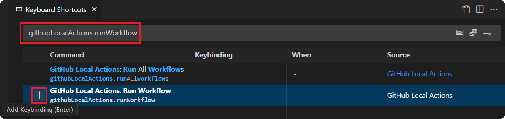

import { CardGrid, LinkCard } from '@astrojs/starlight/components';

The `Workflows` view is where you can manage and run workflows as VS Code tasks. There are several options to executing a workflow.

<CardGrid>
   <LinkCard title="🗃️ Run All Workflows" href="#run-all-workflows" description="Run all workflows in the workspace."/>
   <LinkCard title="📜 Run Single Workflow" href="#run-single-workflow" description="Run a single workflow in the workspace."/>
   <LinkCard title="🚀 Run Job" href="#run-job" description="Run a specific job in a workflow."/>
   <LinkCard title="⚡ Run Event" href="#run-event" description="Run multiple workflows using a GitHub event."/>
   <LinkCard title="📌 Run Workflow Event" href="#run-workflow-event" description="Run a specific event on a single workflow."/>
   <LinkCard title="🧩 Run Job Event" href="#run-job-event" description="Run a specific event on a single job."/>
</CardGrid>

## Accessing Workflow Commands

You can access the workflow and job commands in several convenient ways:

- **View header buttons**: Use the buttons in the Workflows view header for workspace-wide commands (like "Run All Workflows")
- **Hover actions**: Hover over a workflow or job to see inline action buttons that appear on the right side
- **Right-click menu**: Right-click on a workflow or job to open a context menu with available commands

---

## Workflow Discovery

The `Workflows Directory` configuration defined in the [VS Code Settings](https://code.visualstudio.com/docs/getstarted/settings) is what is used by the extension to search for your workflows. By default this is set to `.github/workflows`, but it can be configured in the VS Code Settings by searching for the following configuration:

```log
@ext:sanjulaganepola.github-local-actions githubLocalActions.workflowsDirectory
```

## Run All Workflows

To simply run all workflows in the workspace, use the `Run All Workflows` action on the `Workflows` view. This will start up individual VS Code tasks for each workflow defined in your `.github/workflows` folder and create separate entries in the <a href="/github-local-actions-docs/usage/history">History</a> view.

Each task will execute an `act` command that looks similar to the command below (assuming no <a href="/github-local-actions-docs/usage/settings">settings</a> are being used). In particular, note the `--workflows` options which is used to specify the path to the workflow file being executed.

```sh
act --workflows ".github/workflows/<workflow_file_name>.yaml" --secret-file "" --var-file "" --input-file "" --eventpath ""
```


## Run Single Workflow

If you would like to run just a single workflow, locate the workflow in the `Workflows` view and use the `Run Workflow` action. This action behaves similar to the previous one, except it will only start a VS Code task and create a history entry for the selected workflow.

The `act` command which will be used is the exact same as the previous one (again assuming no <a href="/github-local-actions-docs/usage/settings">settings</a> are being used).

```sh
act --workflows ".github/workflows/<workflow_file_name>.yaml" --secret-file "" --var-file "" --input-file "" --eventpath ""
```

:::tip
If you have a workflow opened in the editor, you can quickly run it by setting your own keyboard shortcut. To do this, open the command palette, select the command `Preferences: Open Keyboard Shortcuts`, search for `githubLocalActions.runWorkflow`, and use the `Add Keybinding` button.


:::


## Run Job

To run a specific job in a workflow, expand the workflow with the desired job in the `Workflows` view and use the `Run Job` action. This action will also only create a single VS Code task and one history entry for the executing job.

The `act` command which will be used is similar to the previous two cases (again assuming no <a href="/github-local-actions-docs/usage/settings">settings</a> are being used), except it will also use the `--job` option which specifies the job ID for the job to execute.

```sh
act --workflows ".github/workflows/<workflow_file_name>.yaml" --job "<job_id>" --secret-file "" --var-file "" --input-file "" --eventpath ""
```


## Run Event

GitHub events are used to configure workflows to run when specific activities happen on GitHub. These same events can be simulated to run multiple workflows locally. To run an event, use the `Run Event` action on the `Workflows` view which will prompt you for the event to trigger. Individual VS Code tasks will be started and history entries will be created for each workflow in the workspace that is set to be triggered by that event.

The `act` command which will be used is similar to the first two cases (again assuming no <a href="/github-local-actions-docs/usage/settings">settings</a>), except it will also include the event name in the command.

```sh
act <event_name> --workflows ".github/workflows/<workflow_file_name>.yaml" --secret-file "" --var-file "" --input-file "" --eventpath ""
```

:::tip
When running certain events, you may require event properties to be defined because their values are used in your workflow. Click <a href="/github-local-actions-docs/usage/settings#payloads">here</a> to learn how to define these properties as an event payload.
:::


## Run Workflow Event

The `Run Workflow with Event` action allows you to trigger a specific GitHub event on a single workflow file. This is useful when you need to test how a specific workflow responds to a particular event.

To run a workflow with an event:

1. Locate the workflow in the `Workflows` view
2. Click the `Run Workflow with Event` button (event icon) in the inline actions or right-click and select it from the context menu
3. Select the event type from the dropdown of events registered in the workflow's `on` section
4. The workflow will run with the selected event type

The `act` command used will include both the event name and target the specific workflow file:

```sh
act <event_name> --workflows ".github/workflows/<workflow_file_name>.yaml" --secret-file "" --var-file "" --input-file "" --eventpath ""
```

## Run Job Event

The `Run Job with Event` action provides even more granular control by allowing you to trigger a specific GitHub event on a single job within a workflow. This is useful when you need to test how a specific job responds to a particular event.

To run a job with an event:

1. Expand a workflow to see its jobs
2. Locate the specific job you want to run
3. Click the `Run Job with Event` button (event icon) in the inline actions or right-click and select it from the context menu
4. Select the event type from the dropdown of events registered in the parent workflow's `on` section
5. The job will run with the selected event type

The `act` command used will include the event name, target the specific workflow file, and specify the job ID:

```sh
act <event_name> --workflows ".github/workflows/<workflow_file_name>.yaml" --job "<job_id>" --secret-file "" --var-file "" --input-file "" --eventpath ""
```

:::tip
Running a workflow or job with a specific event will only execute if that event is registered in the workflow's `on` section. If the selected event isn't configured for the workflow, you'll receive an error message.
:::
