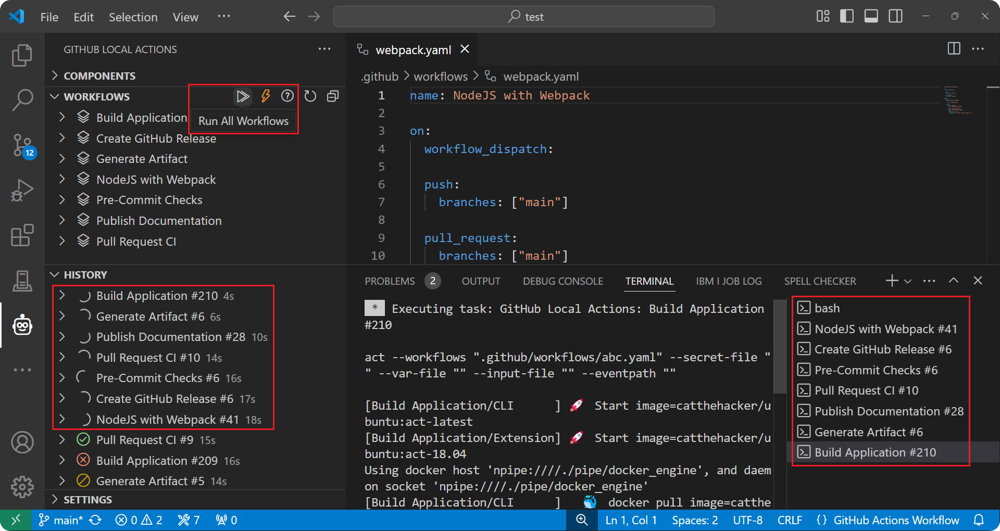
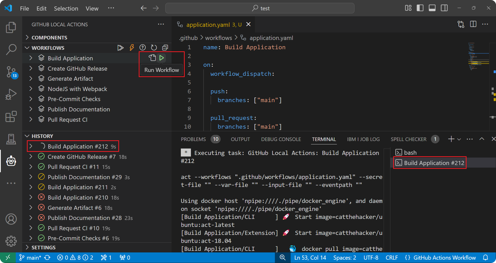
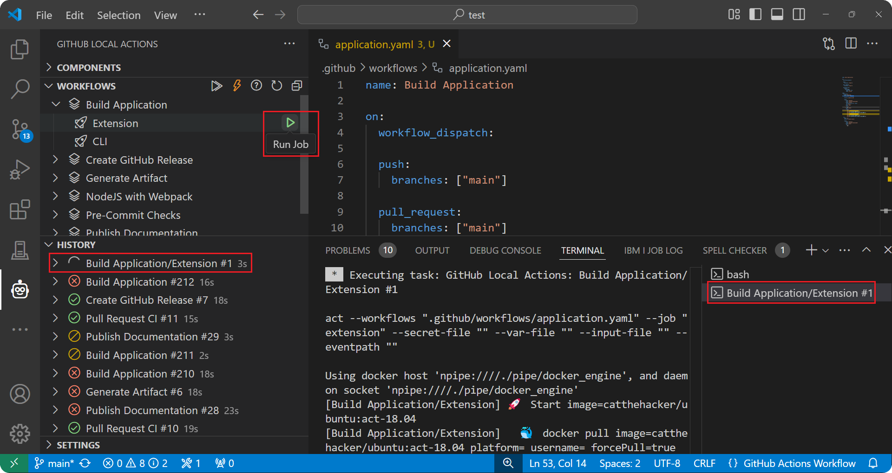
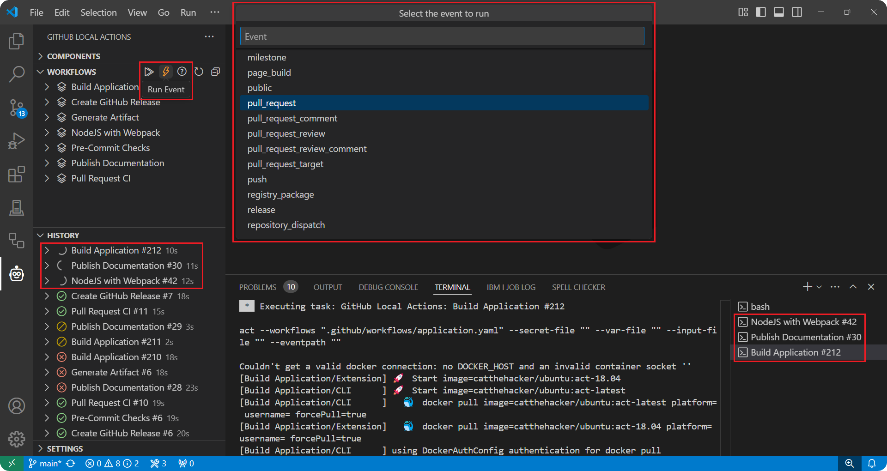

import { CardGrid, LinkCard } from '@astrojs/starlight/components';

The `Workflows` view is where you can manage and run workflows as VS Code tasks. There are several options to executing a workflow.

<CardGrid>
   <LinkCard title="🗃️ Run All Workflows" href="#run-all-workflows" description="Run all workflows in the workspace."/>
   <LinkCard title="📜 Run Single Workflow" href="#run-single-workflow" description="Run a single workflow in the workspace."/>
   <LinkCard title="🚀 Run Job" href="#run-job" description="Run a specific job in a workflow."/>
   <LinkCard title="⚡ Run Event" href="#run-event" description="Run multiple workflows using a GitHub event."/>
</CardGrid>

---

## Run All Workflows

To simply run all workflows in the workspace, use the `Run All Workflows` action on the `Workflows` view. This will start up individual VS Code tasks for each workflow defined in your `.github/workflows` folder and create separate entries in the <a href="/docs/usage/history">History</a> view.

Each task will execute an `act` command that looks similar to the command below (assuming no <a href="/docs/usage/settings">settings</a> are being used). In particular, note the `--workflows` options which is used to specify the path to the workflow file being executed.

```sh
act --workflows ".github/workflows/<workflow_file_name>.yaml" --secret-file "" --var-file "" --input-file "" --eventpath ""
```



## Run Single Workflow

If you would like to run just a single workflow, locate the workflow in the `Workflows` view and use the `Run Workflow` action. This action behaves similar to the previous one, except it will only start a VS Code task and create a history entry for the selected workflow.

The `act` command which will be used is the exact same as the previous one (again assuming no <a href="/docs/usage/settings">settings</a> are being used).

```sh
act --workflows ".github/workflows/<workflow_file_name>.yaml" --secret-file "" --var-file "" --input-file "" --eventpath ""
```



## Run Job

To run a specific job in a workflow, expand the workflow with the desired job in the `Workflows` view and use the `Run Job` action. This action will also only create a single VS Code task and one history entry for the executing job.

The `act` command which will be used is similar to the previous two cases (again assuming no <a href="/docs/usage/settings">settings</a> are being used), except it will also use the `--job` option which specifies the job ID for the job to execute.

```sh
act --workflows ".github/workflows/<workflow_file_name>.yaml" --job "<job_id>" --secret-file "" --var-file "" --input-file "" --eventpath ""
```



## Run Event

GitHub events are used to configure workflows to run when specific activities happen on GitHub. These same events can be simulated to run multiple workflows locally. To run an event, use the `Run Event` action on the `Workflows` view which will prompt you for the event to trigger. Individual VS Code tasks will be started and history entries will be created for each workflow in the workspace that is set to be triggered by that event.

The `act` command which will be used will be the exact same as the first two cases (again assuming no <a href="/docs/usage/settings">settings</a> are being used).

```sh
act --workflows ".github/workflows/<workflow_file_name>.yaml" --secret-file "" --var-file "" --input-file "" --eventpath ""
```

:::tip
When running certain events, you may require event properties to be defined because their values are used in your workflow. Click <a href="/docs/usage/settings#payloads">here</a> to learn how to define these properties as an event payload.

:::

